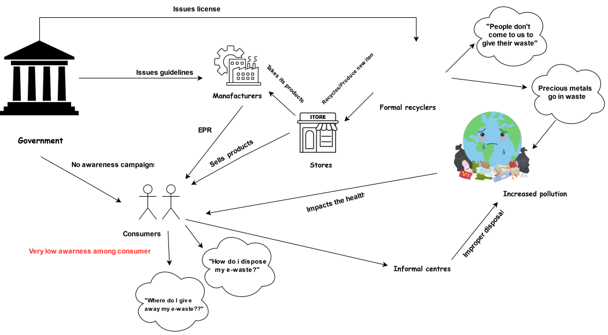
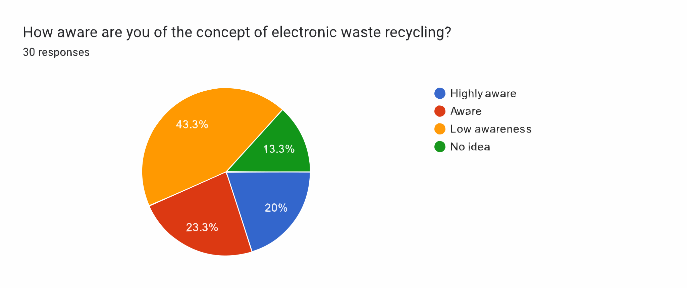
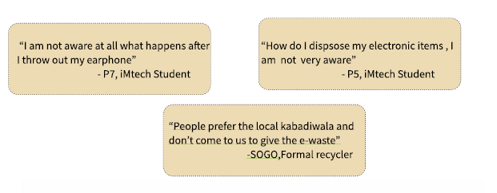
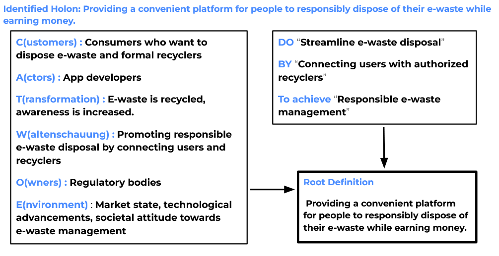
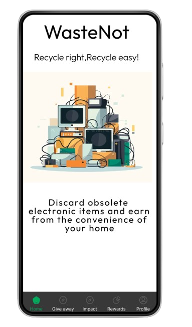

 **As part of a semester long course project in the Social Complexities and Systems Thinking course, along with  Vanshvardhan Singh**

###  Background

E-waste, or electronic waste, refers to discarded electronic devices,smartphones, and other appliances. The improper disposal of such waste can lead to harmful effects on the environment around us as well as on human health. When e-waste is improperly disposed in landfills, toxic substances such as lead,mercury can leach into the soil and water,contaminating the ecosystem(Fathima,2023).

### What was our objective?

As students in Bangalore/Electronic City,we witnessed that a lot of electronic waste is generated in the city and the city ranks [third](https://www.deccanherald.com/india/karnataka/bengaluru/e-waste-is-bengaluru-taking-steps-towards-responsible-disposal-2896923) in the country and so,we sought out to understand the management of electronic waste disposal in and around Electronic City,and to understand people’s approach towards disposing of e-waste.

### What methodology did we adopt?

A mixed approach using qualitative and quantitative research was adopted by us.

A survey was rolled out to understand how e-waste is disposed of and managed by consumers(students) at IIIT-B, and 30 responses were obtained.

We also conducted a total of 17 interviews with different stakeholders, including consumers(13)[students, security staff], a formal recycler (1), Institute IT Management (1), and NGOs (2), to understand the problems surrounding the disposal of e-waste.

 

Fig 1: The different stakeholders in e-waste management

### What did we learn?

  

Fig 2 & 3: Awareness about e-waste recycling

Our most major learning was people are not aware about the not aware about the correct method of disposal process of electronic items and the process after the waste is collected as well.

### Understanding the problem

 We adopted a soft system methodology(Reynolds,2011) approach in order to understand the problematic situation and identify a solution for it.

“Soft systems methodology (SSM) is an approach for tackling problematical, messy situations of all kinds. It is an action-oriented process of inquiry into problematic situations in which users learn their way from finding out about the situation,to taking action to improve it(Checkland & Poulter,2010).”

Fig 4: The Root definition

### Our proposed solution

Based on the soft systems approach, we identified the need for awareness among people about e-waste and a means for them to connect with formal recyclers, and thus, have proposed the following solution:

 
A solution to allow consumers to dispose e-waste from the comfort of their homes and also ensure formal recyclers get connected with the consumers to take up the e-waste

Fig 5: Design mock up of the proposed solution

We make use of ONDC, an initiative by the Government of India to promote an open e-commerce network.  It create an inclusive e-commerce environment and gives the consumer freedom to choose their desired store to recycle their e-waste.

 **User Features**

 - The application allows users to sell e-waste for cash and in-app points. 
 - Users can also take quizzes to boost their awareness about electronic waste, and earn in-app points.
 - Users can redeem these points on gift-cards

 **Recycler Features**
 
- The recycler can provide a list of items they are ready to take from consumers
- The recycler can modify the list of items by adding and removing them
- They can also view the order status and modify the order status
 
To view the complete design file,please [click here ](https://www.figma.com/design/MXtRkvuQkkER04a7NyoxBg/WasteNot?node-id=0%3A1&t=HE7GMvfQ26rJqTwe-1)!

### References
- Reynolds, M (2011). Bells that still can ring: systems thinking in practice. In: Tait, Andrew and Richardson, Kurt eds. Moving Forward with Complexity: Proceedings of the 1st International Workshop on Complex Systems Thinking and Real World Applications. Litchfield Park, AZ: Emergent Publications, 327 349.
- Fathima, I. (2023, November 22). Citizens’ organisations join forces for sustainable disposal of ewaste. Bangalore Mirror. [https://bangaloremirror.indiatimes.com/bangalore/others/citizensorganisations-join-forces-for-sustainable-disposal-of-e-waste/articleshow/105395294.cms](https://bangaloremirror.indiatimes.com/bangalore/others/citizensorganisations-join-forces-for-sustainable-disposal-of-e-waste/articleshow/105395294.cms)
- Checkland , P., & Poulter , J. (2010). Soft systems methodology. In Systems approaches to managing change: A practical guide (pp. 191 242). Springer London.