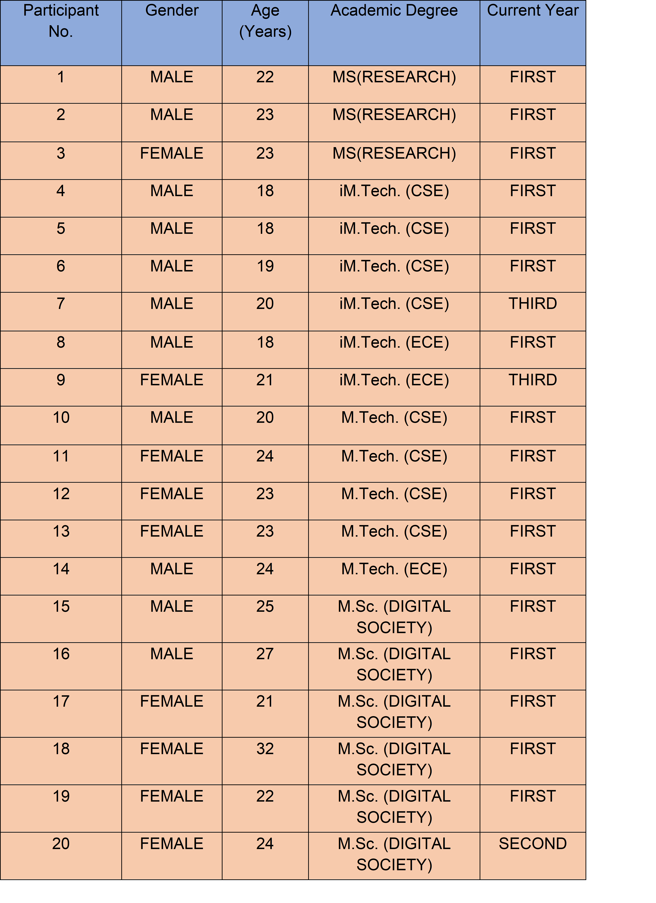

 **As part of a semester long course project in the Qualitative Research Methods course, along with  Akash Kumar and Sarwan Kumar**

 ###  Background

The availability of advanced Artificial Intelligence tools, such as ChatGPT, has enabled easy access to Large Language Models (LLMs) for students. These models have the capability to produce unique written content, serving as valuable aids for students in their academic assignments. As the use of LLMs gains momentum, as evidenced by the widespread popularity of OpenAI's ChatGPT and Google’s Gemini, there is an increasing need to explore their potential applications in the field of education.

### The Research Questions?

The application of LLMs is a new research topic in education,especially if we consider the most recent LLMs with outstanding emerging capabilities. LLMs can provide effective translations, summarizations of complex text, and it can generate text by replacing the work of reading, synthesis, integration of sources, and paraphrasing of texts.A collection of contributions,challenges and implications in relation to using LLMs in the sector of education. 

While some schools and universities have banned the use of LLMs (Johnson, 2023), these tools can be seen as an opportunity to rethink some traditional learning processes. Examples that may be similar are the following: the calculator is allowed to facilitate work in complex mathematical problems, no longer placing importance on the ability to perform calculations on paper; and CAD software is used to design more quickly, without requiring students to draw by hand.
This study aims to understand the perceptions of university  students on the use of LLM based AI tools in their everyday lives and how these tools influence their academic learning experiences. 
The primary research question of this study is:

**RQ1.** What are the overall attitudes of students towards theLLM-based AI tools in their day to day activities?
 

**RQ2.** Are students comfortable with the data-sharing practices associated with AI tools, and to what extent do they believe their personal information is safeguarded during interactions with these tools?

### Methodology

The study primarily aimed to understand the perceptions and experiences of students at the International Institute of Information Technology,Bangalore in their everyday lives. The primary mode of data collection for the research process was through in person interviews. Additionally, secondary data collection methods such as peer-reviewed journals, articles,reports etc were used in the research and framing the interview guide. The sampling method adopted was snowball sampling and the participants were students enrolled in  different study programs at the institute. Interviews of a total twenty participants were conducted on a one-on-one basis physically at the campus premises. After taking the participant’s consent, written notes and audio recordings with smartphones were taken.

### Data Analysis

The data collected through the interviews, consisting of a combination of both open and closed ended questions, was analysed by a two tier approach. First, we used descriptive analysis of the quantitative data collected through close-ended questions. The responses of open ended questions were analysed through the axial coding method to understand the qualitative data. This method offered us to recognize the recurring themes, patterns and gave deeper insights of the participants' understanding and experiences. 

Fig 1: Description of the IIITB students who participated in the study

### Findings

In this section, the finfings are structured by describing how participants used LLM based tools, how they used generative AI tools in their academic work, and how their usage has evolved over time.

 1.  **Attitude**

College students generally exhibited a  positive attitude towards the acceptance of tools like Chat GPT, Google Bard etc. They remarked that the use of such tools has helped in saving time spent searching through the traditional searches and their efforts for gathering information has decreased.

_“I came to know about this after I took admission at IIIT-B ”-  P13_
                                                                                    
_“ I started using Chat GPT around December 2022, a few days after its launch”-P19_

Fig 2:  Usage of different tools among students

 
2.  Ease of Access

Generative tools like Chat GPT are increasingly acting as a virtual assistant for the students by providing them personalised learning support and answering their questions immediately. Some students also suggested that such tools helped understanding the fundamental queries about a specific topic ,providing them with instant clarification and can serve as a starting point to help develop and expand on their ideas.For the programming assignments, students remarked that the AI tools have helped extensively in their debugging processes. It has reduced the efforts taken in analysing the code and identifying the potential errors.

_“I make use of Chat GPT to summarise research papers and it helps in understanding mathematical formulas”-P-3_

3. Trust and Reliability

Majority of the students said that they were cautious of entering their personally identifiable data on such platforms. They are equally concerned about their personal data being collected at a similar level to the tech giants like Alphabet and Meta.  

_“I do not use my official email id for logging into Chat-GPT because I fear they could trace it back to my bank account” -P14_

                                                                         
The acknowledgment that their personal data might be subject to collection at a similar scale as that of these industry behemoths raises concerns about the scope, intent, and potential consequences of such data aggregation by such platforms

4. Impact on Career

Majority of the participants were not worried about their job prospects for the future.   They argued that while AI can automate mundane tasks, it requires human supervision to ensure its proper functioning. The ability to identify and rectify errors, troubleshoot unforeseen challenges, and adapt to dynamic environments are all crucial for maintaining the integrity and efficiency of automated processes. These skills, which are honed through experience and expertise, lie beyond the scope of current AI capabilities. Instead of viewing AI as a threat to their job prospects,students viewed it as an opportunity to enhance their own skills and become more valuable within the evolving workforce.

_“As long as you have the necessary skills and stay ahead of the curve,you need not worry about the rise of AI”      -P19_

_“When Internet came,people thought they will lose their jobs,but we all now know ,how big the IT sector is” -P15_

### Conclusion

Our study explores college students' perceptions of LLMs and AI tools, highlighting their positive views on efficiency and information retrieval. Social influence plays a key role in adoption, with students seeing these tools as complementary to traditional learning. Privacy concerns and cautious data usage reflect apprehension about AI platforms. Optimism around career prospects suggests AI is seen as an opportunity for skill enhancement, not a job threat. These insights guide future efforts for responsible and balanced integration of AI in education.
