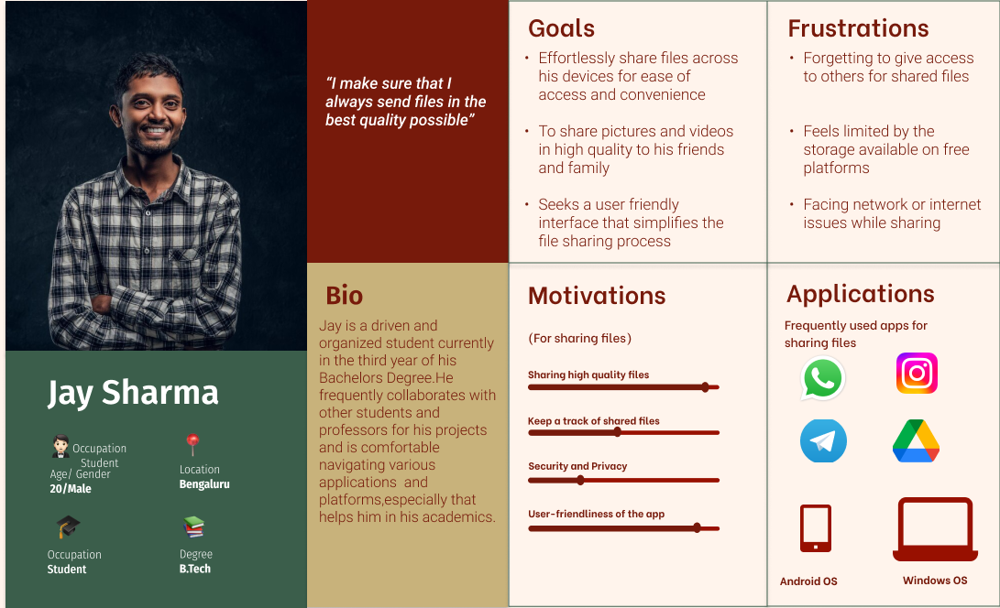
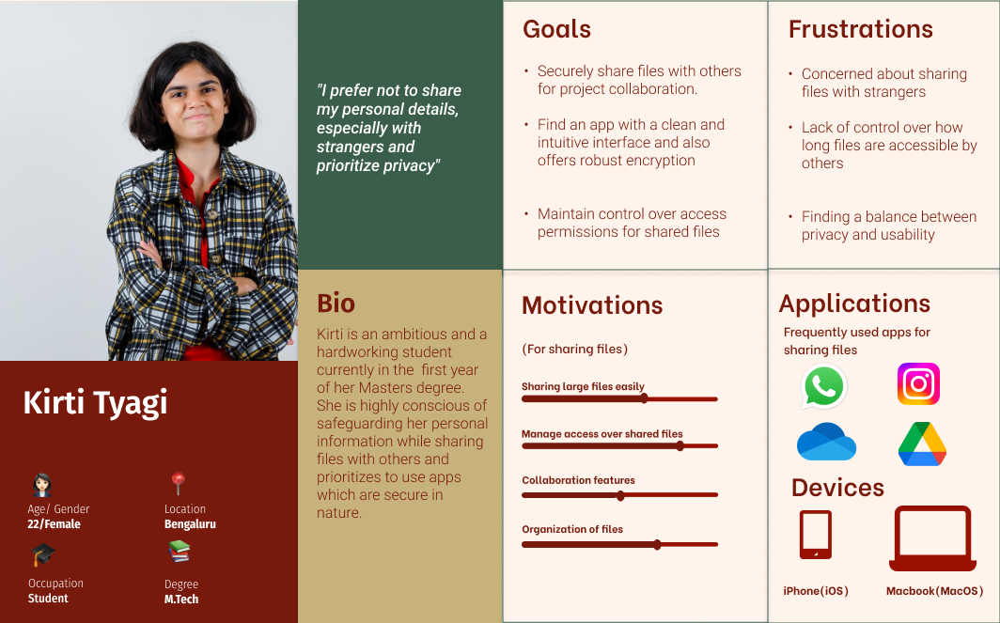
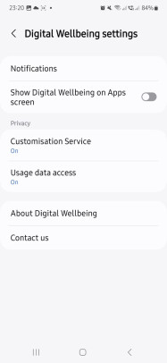
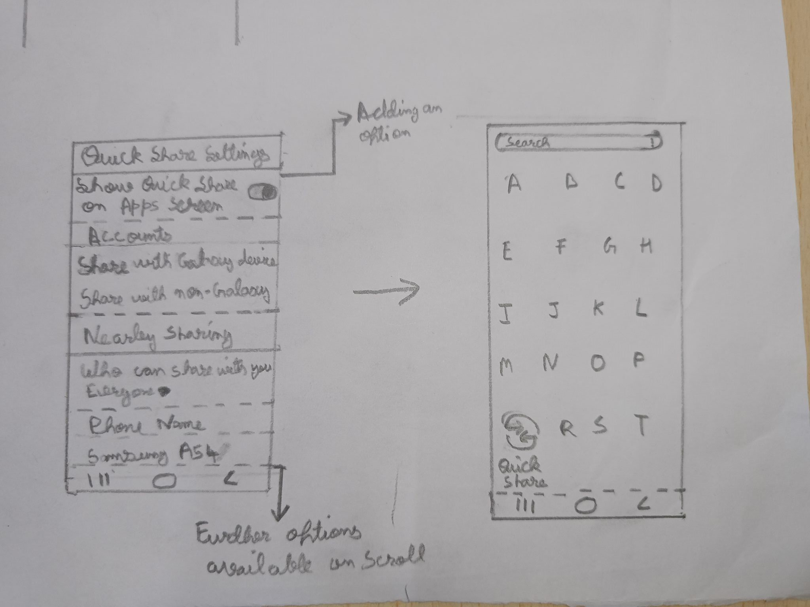
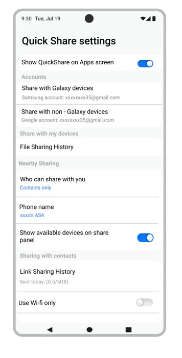
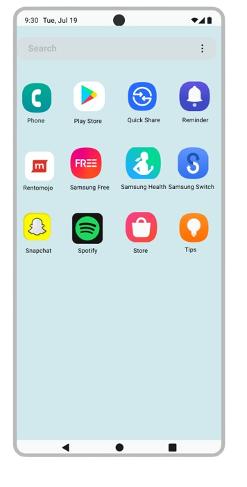
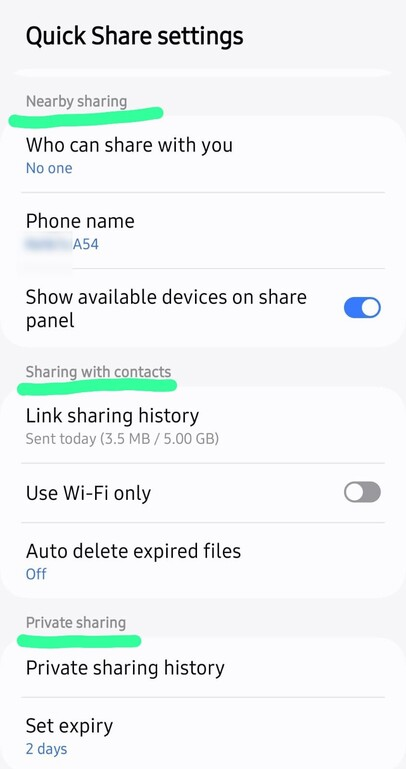
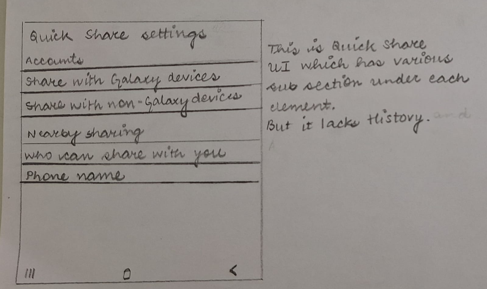
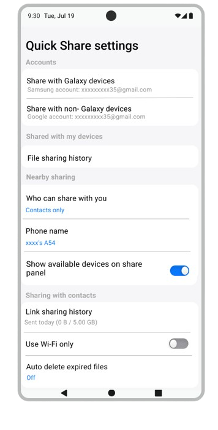
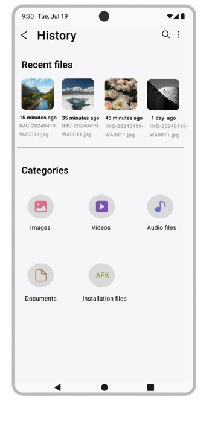

 **As part of a industry UX research internship with Samsung R&D India from January to May 2024, along with  Aparna Sharma and Ketki Bhatia**

Samsung R&D India, Bangalore, collaborated with our Human-Computer Interaction class at IIIT-B, engaging us in an industry-focused research internship. The challenge was to investigate how people share files and identify ways to enhance the user experience of their application, Quick Share.

The project was guided by [Prof. Preeti Mudliar](https://preetimudliar.work/), the instructor for the HCI course. While our group conducted independent research, we benefited from the professor's valuable feedback and guidance throughout the process. Additionally, we delivered weekly presentations to the company team, sharing updates on our progress and research findings. 
  
## My Role
The research project was a collective effort, with equal contributions from all team members. In addition to the research tasks, I took on the responsibility of guiding the team through the process. I contributed by assisting in the creation and refinement of the interview guide, leading the interviews and analysis, and designing and collaborating on Figma prototypes.

## The Problem Statement
The company aimed to address three main questions through our research:

1. Why is Quick Share not widely used by users?
2. How do people currently share their files?
3. What enhancements can make the file-sharing experience better and more seamless?

## Initial Work

Our team was initially tasked with identifying competitors in the market and presenting a comprehensive overview of their features and ease of use compared to QuickShare.

## Research Questions
Our team primarily focused on the process of sending and sharing files.

The questions were divided into categories, with some sample questions as follows:
| **Theme**                           | **Sample Question**                                                                                                                                                                  |
|-------------------------------------|--------------------------------------------------------------------------------------------------------------------------------------------------------------------------------------|
| Device                              | When was the last time you transferred a file between two devices that you own? What kind of file was it?                                                                            |
| Mode (internet presence or absence) | When was the last time you shared a file with limited internet access? How did you do it?                                                                                            |
| File type, size                     | If you need to share files with a large number of people (e.g., event photos).,how do you decide the platform and sharing method (e.g., ease of access, download limits, analytics)? |
| Security                            | When was the last time you sent a file where file security was a concern for you? What did you do to  ensure that your file was shared securely?                                      |

After the initial phase of interviews, our team further narrowed its focus to personal ecosystem sharing.
 | **Theme**                    | **Sample Question**                                                                                                      |
|------------------------------|--------------------------------------------------------------------------------------------------------------------------|
| Device Usage Patterns        | how often do you find yourself needing to transfer files between your own devices?                                       |
| Challenges and Pain Points   | Are there any difficulties that you face while sharing files between devices?What do you attempt to overcome the issues. |
| Preferences and Expectations | Are there any factors that influence your choice of transfer method( file size, speed, compatibility)                    |

## User Personas 

User personas were further developed to gain a deeper understanding of the target audience's behaviors, preferences, and pain points. This helped us tailor our approach to better address the specific needs and challenges faced by users in the file-sharing process.

Fig 1:Jay's Persona

 

Fig 2:Kirti's Persona

## Affinity Mapping
We conducted affinity mapping to organize and analyze the insights gathered from our interviews.Each key observation was noted on sticky notes, which were then grouped based on recurring themes and patterns. This process helped us identify common user behaviors, challenges, and preferences, providing a structured foundation for further analysis.

## Insights and recommendations based on the interviews

Through multiple rounds of interviews, three key methods emerged as the most popular:
1. WhatsApp

Unanimously favored during all four rounds of interviews, WhatsApp stands out as the most preferred platform for file sharing. Its popularity is attributed to its ease of access and convenience. Respondents appreciated features like:

- Cross-device accessibility through WhatsApp Web or the desktop app.
- The ability to chat with oneself, enabling quick and personal file storage.

Whether for sharing within a single device ecosystem or between multiple devices, WhatsApp has become a ubiquitous solution, loved for its simplicity and versatility.

2. Google Drive

Google's ecosystem and its seamless integration have made Google Drive another widely used option among our respondents. Key reasons for its popularity include:

- The ease of logging into Google accounts on multiple devices.
- Efficient file management capabilities.

For respondents looking for cloud-based storage and sharing, Google Drive was a go-to solution.

3. USB Cable

Despite the rise of internet-based file-sharing options, the traditional USB cable remains a reliable method. Respondents preferred this method in scenarios where:

- Internet connectivity was limited or unavailable.
- Large volumes of files needed to be transferred.
 

### What is the most  major pain point?
**Discoverability**

Finding and using Quick Share intuitively has been the biggest pain point across our four rounds of interviews. People have indicated that they have come across Quickshare a few times but have always preferred other applications over it.

Our respondents  mentioned that there has been negligible awareness created regarding the availability of Quickshare and its functionalities which has contributed to its less usage among the users of Samsung devices. Additionally, what the feature does and how it works was also not clear to a lot of users. 

### How did we plan to approach this pain point?
Thus, to reduce the pain point of discoverability we approached this problem in a set of different ways outlined in detail as follows :

Fig 3:Proposed UI Screens

1. Add as an icon/shortcut to the app list
Currently, Quick Share settings can only be accessed through only two options: 

i) Through the Quick Settings Panel
ii) Through Settings

This makes the process for finding the options available under QuickShare cumbersome for the end user. To mitigate this, we propose the following:

Taking the example of Digital Wellbeing ,which  allows a user to show the icon on the app list as shown in the below image :

 

Fig 4:Digital Wellbeing UI on a  Samsung Phone

Fig 5:: UI Sketch for listing QuickShare on the Apps Screen

### Figma Prototypes

Fig 6:: Option to show QuickShare on the Apps list

Fig 7:: QuickShare on the Apps list

 
2. Adding an option for “Shared with My Devices”

In the Quick Share settings UI, there are several options related to Accounts, Nearby Sharing, Sharing with Contacts, and Private Sharing. However, none of these subsections include an option for "Shared with My Devices," which would allow users to view the history of files shared with their personal devices. The History feature, which would typically enable users to view shared files directly without creating a link, is also absent in Quick Share. Furthermore, there is no way to view files that have been shared specifically with "my devices" (personal devices).

Fig 8:Quick Share UI with various subsections

The process becomes cumbersome if the user has to view what files he  she shared within their own devices.

To navigate through this issue, the following was proposed:

An additional section is added titled “Shared with my devices” allowing the user to view the shared files between their own devices easily. Additional options to search and sort the files by date can also be provided to the user.

Fig 9:UI Sketch of  Quick Share  with proposed subsections

### Figma Prototypes

Fig 10:Separate option to view file sharing history for personal devices

Fig 11:View file sharing history

### Final Thoughts

This project was my first hands-on experience in the industry, and it was both exciting and challenging. We made great strides in understanding user needs, but unfortunately, we couldn’t conduct usability testing due to time constraints. Despite this, the experience taught me a lot about working in a real-world setting, and I’m grateful for the valuable lessons I gained along the way.

**If you have any questions or want to know more about the project,feel free to email me!**
