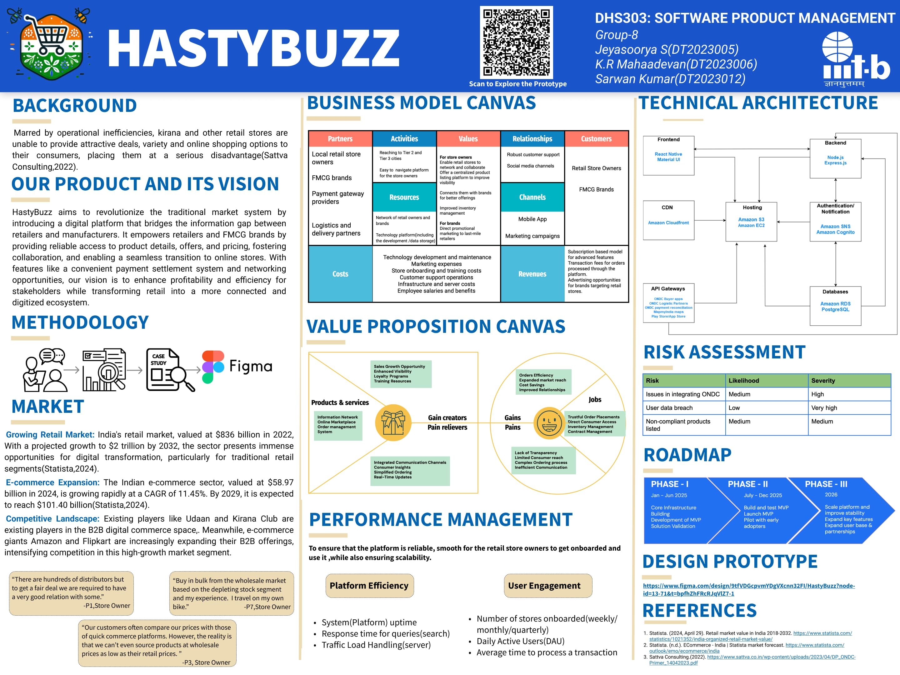
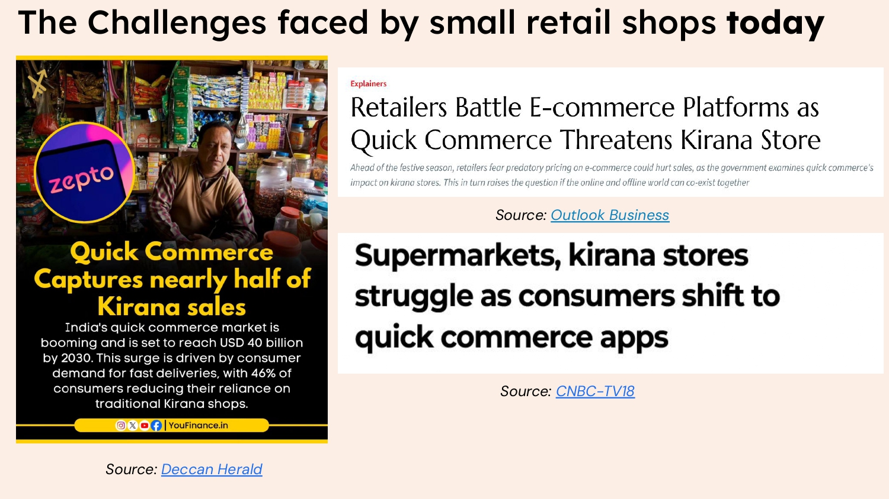
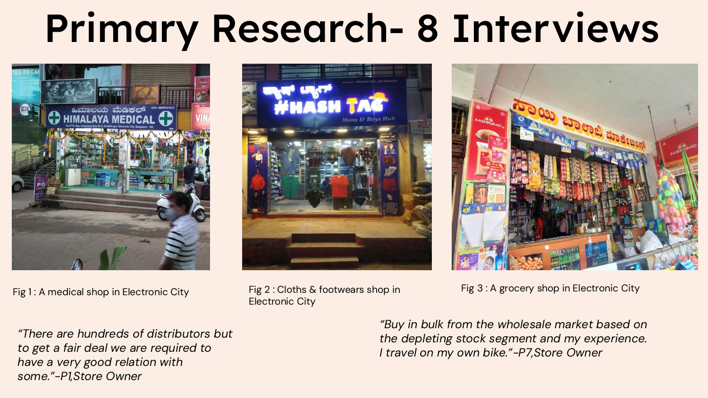
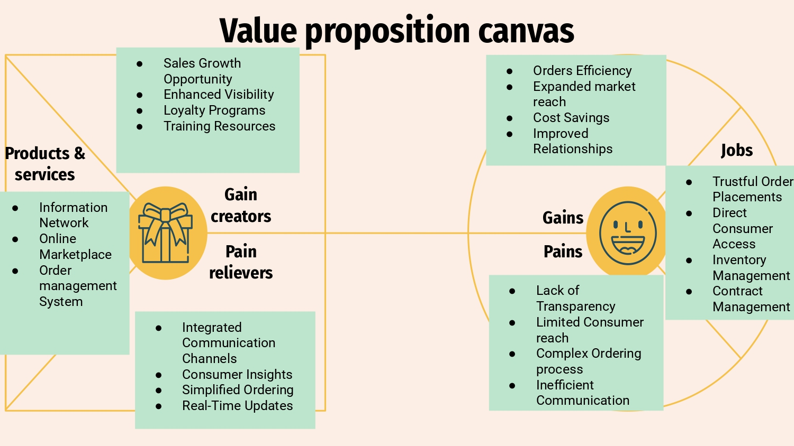
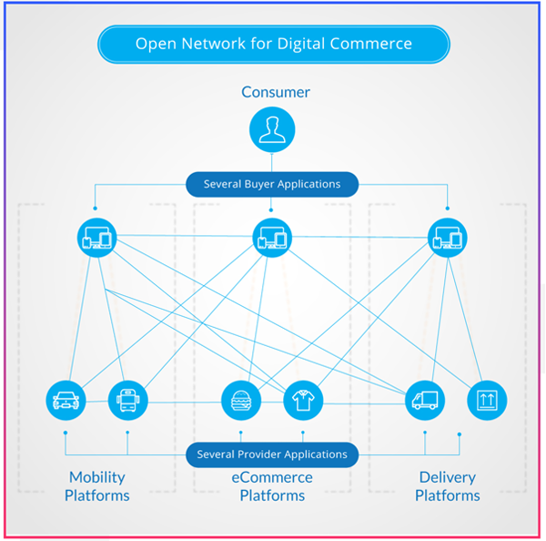
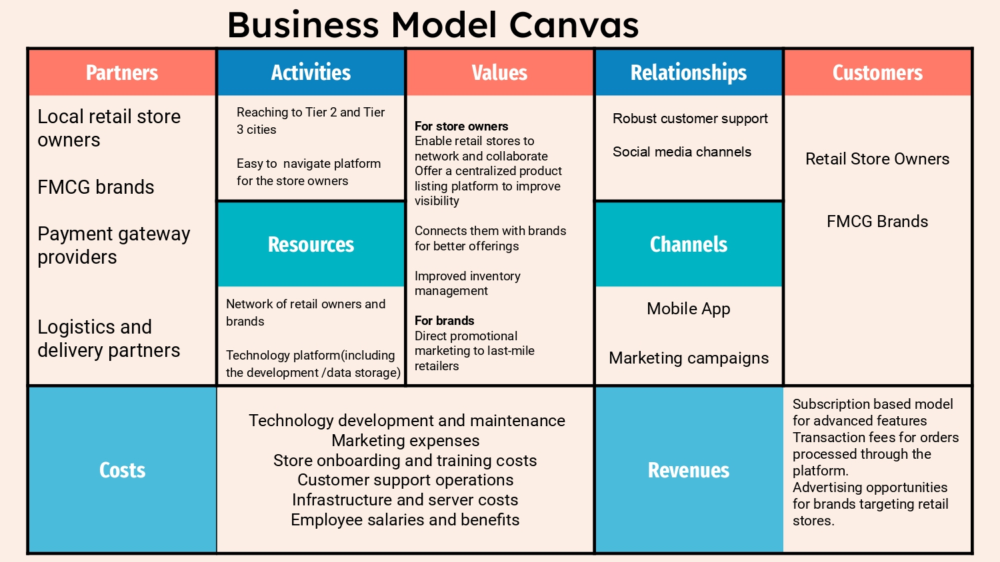

 **As part of a semester long project from August 2024 to November 2024, along with  Sarwan Kumar and Jeyasoorya Saravanan**

## My Role
I took on the responsibility of guiding the team through the process. I contributed by assisting in primary and secondary research, leading the interviews and analysis through product management frameworks, and designing and collaborating on Figma prototypes.

## The Problem Statement

Fig 1:Challenges faced by retail store owners

In an era dominated by e-commerce and quick-commerce platforms, traditional retail markets in India face challenges like operational inefficiencies and limited consumer reach. HastyBuzz seeks to address these hurdles by offering small retailers the tools and support they need to thrive in a digital economy. 

Traditional retailers, particularly kirana stores, pharmacies, and local outlets, struggle with:

- Inefficient supply chains that hinder cost savings.
- Lack of digital presence, limiting their market reach.
- Difficulty in competing with attractive deals offered by large e-commerce platforms

Fig 2:Primary Research

## Product Vision
Transforming traditional market system by adding up a digital dimension and bridgingthe information gap between the retailers & Manufacturers to make them more profitable.

## The Market for the product
HastyBuzz’s offerings are designed to address the core needs of its users:

- Retailers: Enhanced visibility, streamlined inventory management, and access to new consumers.
- Manufacturers: Direct promotional opportunities and better distribution channels.
- Customers: Improved shopping experiences and access to diverse products.
 
## Value proposition Canvas

 HastyBuzz emphasizes its focus on empowering small retailers and FMCG brands by addressing key challenges. It alleviates pains like inefficient communication, limited consumer reach through integrated communication channels, and streamlined order management. Simultaneously, it creates gains such as improved visibility, enhanced consumer insights, and direct access to end users via a centralized online marketplace.  
 

Fig 3:Value Proposition Canvas

At the heart of HastyBuzz lies the Open Network for Digital Commerce (ONDC) initiative, which democratizes e-commerce in India. By adopting ONDC’s open protocol, HastyBuzz ensures:

- Easy onboarding for small retailers.
- Efficient order and inventory management.
- Scalability to reach tier-2 and tier-3 cities with untapped potential.

Fig 4:An overview of the ONDC protocol [<a href="https://ondc.org/">Source</a>]

## Business Model Canvas
 

Fig 5:Business Model Canvas

## Performance Management
Performance management is critical for the success of HastyBuzz as a reliable, scalable, and efficient platform.

Key Metrics to Measure Performance

To ensure high reliability and user satisfaction, HastyBuzz tracks the following metrics:

### Platform Efficiency

1. System Uptime: Monitoring the platform’s availability to ensure it remains operational 24/7.
2. Query Response Time: Measuring how quickly the platform processes search queries to maintain user satisfaction.
    Traffic Load Handling: Evaluating server performance during peak usage to prevent downtime or slowdowns.

### User Engagement

1. Number of Stores Onboarded: Tracking onboarding rates on a weekly, monthly, and quarterly basis to measure growth.
2. Daily Active Users (DAU): Monitoring the number of active users to gauge engagement and the platform's utility.

### Approaches to Optimize Performance

- Implementing Caching: To reduce the load times for search queries, caching mechanisms store frequently accessed data, enabling faster retrieval and a smoother experience for users.

- Cloud-Based Infrastructure: Leveraging scalable cloud solutions allows HastyBuzz to efficiently handle increased traffic and data storage needs. This ensures the platform remains robust and responsive as the user base grows.

## Legal Aspects

By embedding transparency and user-centric controls, the platform ensures that legal obligations are met without compromising user experience.

1. Transparently presenting the privacy policy and the terms & conditions on the platform.
2. Options to request access to data and delete the seller account

## Prototype

<iframe style="border: 1px solid rgba(0, 0, 0, 0.1);" width="800" height="450" src="https://embed.figma.com/design/9tfVDGcpvmYDgVXcnn32FI/HastyBuzz?node-id=0-1&embed-host=share" allowfullscreen></iframe>

To view the complete design file,please [click here ](https://www.figma.com/design/9tfVDGcpvmYDgVXcnn32FI/HastyBuzz?node-id=0-1&t=yAHsolU1D5HYKeVy-1)!

## Conclusion

HastyBuzz represents a comprehensive approach to modernizing traditional retail in India. By democratizing access to digital tools and market connections, it enables small and medium retailers to effectively compete in today's evolving business landscape.The platform serves as a catalyst for digital transformation, helping to level the playing field and create a more inclusive retail ecosystem across India.

**If you have any questions or want to know more about the project,feel free to email me!**
